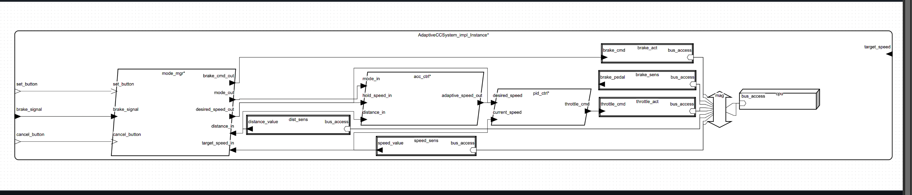

# Adaptacyjny Tempomat – model AADL

## Informacje o projekcie

**Nazwa systemu:** Adaptacyjny tempomat (ACC)  
**Autor:** *Jakub Karoń*  
**E-mail kontaktowy:** *jakubkaron@student.agh.edu.pl*

---

## Co robi system?

Zaprojektowany system to adaptacyjny tempomat, który automatycznie zarządza prędkością pojazdu. Działa w kilku trybach i dynamicznie reaguje na sytuację drogową, bazując na danych z czujników:

- tryb **Hold** utrzymuje zadaną prędkość,
- tryb **Adaptive** dostosowuje ją do dystansu do poprzedzającego pojazdu,
- **Stop** wymusza hamowanie, jeśli to konieczne,
- a **Off** dezaktywuje funkcje.

Użytkownik korzysta z dwóch przycisków: **SET** i **CANCEL**, a całość reaguje też na sygnał z pedału hamulca.

---

## Budowa modelu – warstwy systemu

### 1. Warstwa sprzętowa

Układ oparty jest na pojedynczym CPU, do którego przez magistralę podłączone są sensory i aktuatory.

**Elementy fizyczne:**

| Nazwa                 | Typ urządzenia  | Funkcja                                | Masa [kg] |
|-----------------------|------------------|-----------------------------------------|-----------|
| `Central_CPU`         | procesor         | kontrola wątków                         | 0.05      |
| `Control_Bus`         | magistrala       | transmisja danych                       | 0.10      |
| `Speed_Sensor`        | sensor           | prędkość pojazdu (km/h*100)            | 0.02      |
| `Distance_Sensor`     | sensor           | dystans do innego pojazdu (m*100)      | 0.03      |
| `Brake_Signal_Sensor` | sensor           | sygnał z hamulca (ON/OFF)              | 0.01      |
| `Throttle_Actuator`   | aktuator         | sterowanie przepustnicą (0–100%)       | 0.15      |
| `Brake_Actuator`      | aktuator         | włączenie hamulca                      | 0.20      |

---

### 2. Warstwa funkcjonalna (oprogramowanie)

System logiczny oparty jest na trzech głównych procesach:

#### **ModeManager**
Zajmuje się wyborem trybu na podstawie sygnałów wejściowych (przyciski, dystans, hamulec). Steruje trybem pracy i może wymusić hamowanie.

#### **ACCController**
Działa tylko w trybie `Adaptive`. Oblicza bezpieczną prędkość na podstawie dystansu do pojazdu z przodu.

#### **PIDController**
Reguluje sygnał do przepustnicy, porównując aktualną prędkość z wartością zadaną.

**Wątki:**

| Nazwa         | Typ      | Częstotliwość | Priorytet | Opis działania |
|---------------|----------|---------------|-----------|----------------|
| `ModeManager_Thread` | Periodic | 10 ms        | 10        | przełączanie trybów |
| `ACC_Thread`         | Periodic | 50 ms        | 8         | obliczanie adaptacyjnej prędkości |
| `PID_Thread`         | Periodic | 50 ms        | 7         | sterowanie przepustnicą |

---

### 3. Integracja systemowa

Główna jednostka systemowa to `AdaptiveCCSystem`. Zawiera wszystkie urządzenia, CPU, magistralę i procesy.

**Przykładowe powiązania logiczne:**
- `Speed_Sensor` dostarcza dane zarówno do `PIDController`, jak i `ModeManager`.
- `ModeManager` przekazuje sygnały do `ACCController` i `PIDController`.
- `PIDController` steruje `Throttle_Actuator`, a `ModeManager` – `Brake_Actuator`.

**Wiązania sprzętowe:**
- Wszystkie komponenty są powiązane z jedną magistralą `mag` oraz procesorem `cpu`.

**Połączenia międzyprocesowe są przypisane do magistrali**, co było konieczne do poprawnego przejścia analiz AADL.

---

## Analizy i testy

System został poddany kilku analizom narzędziowym w OSATE. Oto wyniki:

| Rodzaj analizy                | Cel testu                                            | Status            |
|------------------------------|------------------------------------------------------|-------------------|
| Wiązania (`BindingConstraints`) | Czy wszystkie komponenty mają przypisany CPU i magistralę | ✔ brak błędów     |
| Masa (`WeightAnalysis`)         | Czy komponenty mają zdefiniowaną masę              | ✔ masa: **0.560 kg** |
| Magistrala (`BusLoadAnalysis`) | Czy przepustowość nie jest przekroczona            | ✔ obciążenie: **0.02 KB/s** |
| Połączenia (`ConnectionBindingConsistency`) | Czy połączenia są przypisane do fizycznej magistrali | ✔ wszystkie poprawnie |
| Porty (`PortConnectionConsistency`) | Czy porty są dobrze połączone i zgodne typami     | ✔ bez błędów       |

---

## Całkowita masa systemu

Zsumowane masy według właściwości `SEI::GrossWeight`:

| Komponent         | Masa [kg] |
|-------------------|-----------|
| `mag`             | 0.100     |
| `speed_sens`      | 0.020     |
| `dist_sens`       | 0.030     |
| `brake_sens`      | 0.010     |
| `throttle_act`    | 0.150     |
| `brake_act`       | 0.200     |
| `cpu`             | 0.050     |
| **Suma**          | **0.560** |

---

## Schemat systemu

Poniżej graficzna reprezentacja połączeń komponentów (CPU, magistrala, sensory, wątki, aktuatory):

---

## Możliwe rozszerzenia systemu

Projekt można rozbudować o dodatkowe funkcjonalności:

- Rozpoznawanie znaków drogowych (np. ograniczenia prędkości)
- Integracja z nawigacją lub mapą HD
- Uczenie maszynowe do predykcji stylu jazdy poprzedzających pojazdów
- Obsługa tempomatu zdalnie (np. sterowanie przez aplikację)

---

## Wnioski końcowe

System adaptacyjnego tempomatu został pomyślnie odwzorowany w AADL i przeszedł wszystkie kluczowe analizy. Poprawne odwzorowanie połączeń, wiązań i priorytetów sprawia, że jest to dobra baza do dalszych eksperymentów lub wdrożeń.

